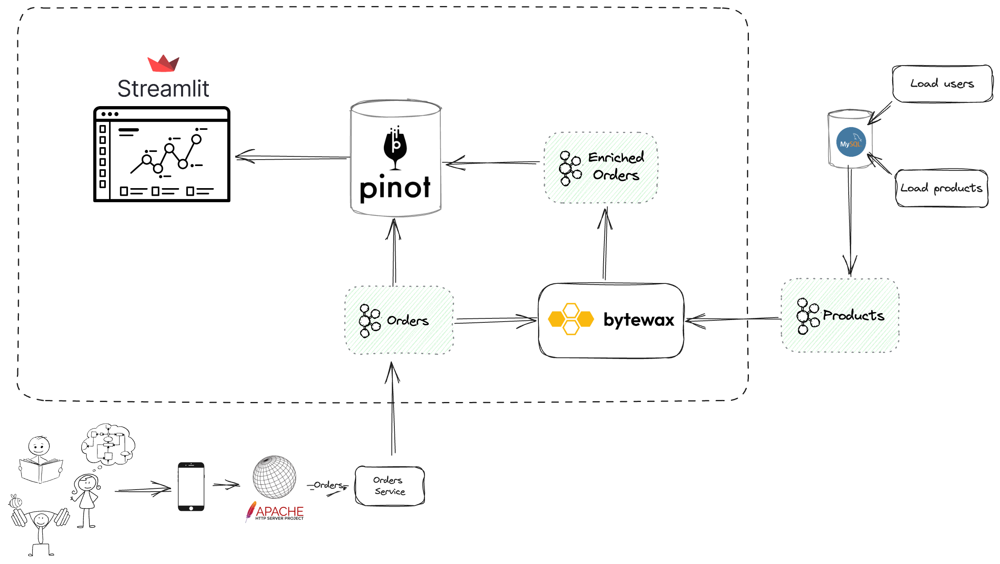

# Visualization project on Dominos Pizza Shop with Apache Pinot

This repository contains the code for the Pizza Shop Demo, showcasing a real-time analytics application using Apache Pinot.

## Prerequisites

Only prerequisites is to have docker installed on your machine before starting the demo.

 TODO: EDIT ~  TODO: EDIT

## How to Run the Demo

To start the demo, execute the following commands in your terminal:

```bash
docker-compose up -d

docker exec pinot-controller ./bin/pinot-admin.sh \
		AddTable \
		-tableConfigFile /config/orders/table.json \
		-schemaFile /config/orders/schema.json \
		-exec

docker exec pinot-controller ./bin/pinot-admin.sh \
		AddTable \
		-tableConfigFile /config/order_items_enriched/table.json \
		-schemaFile /config/order_items_enriched/schema.json \
		-exec
```
After the demo is up and running, you can access the following interfaces in your web browser:

- **🍷 Pinot Query UI:** [http://localhost:9000](http://localhost:9000)
- **Streamlit Dashboard:** [http://localhost:8502](http://localhost:8502)

TODO: EDIT ~ For a detailed explanation of each component in the demo, visit the [documentation page](https://dev.startree.ai/docs/pinot/demo-apps/pizza-shop).


## Stopping the Demo

To stop all the services and clean up the resources used run the following:

```bash
docker compose down -v
```